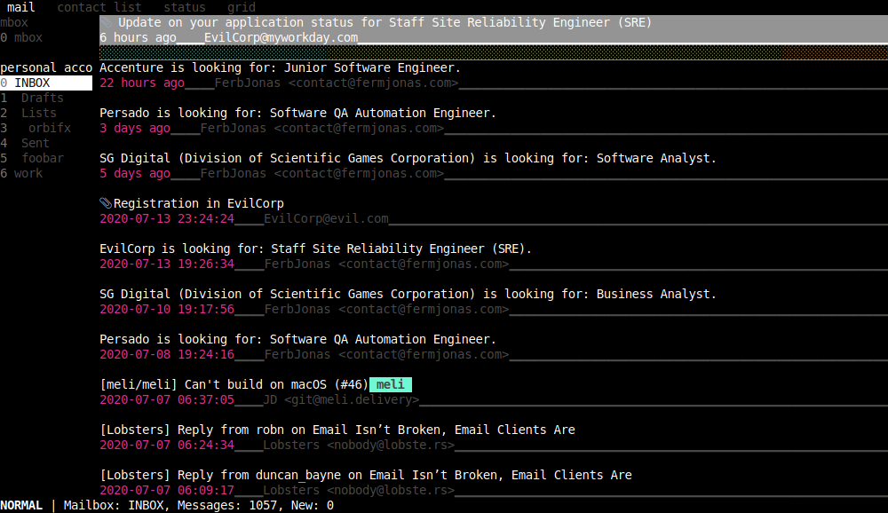
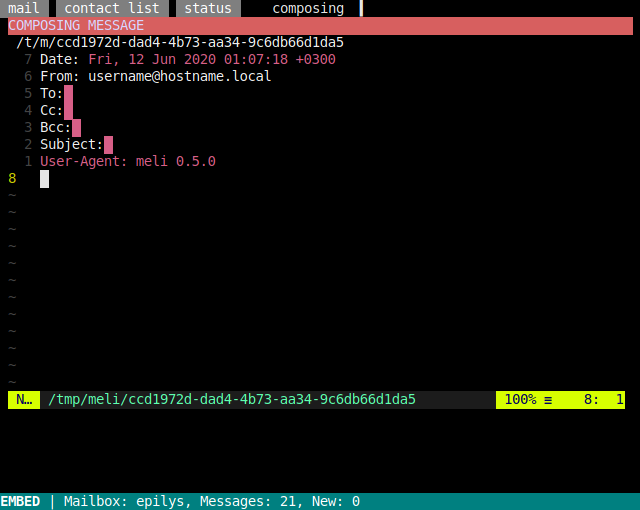

# meli    [](https://github.com/meli/meli/blob/master/COPYING) [](https://crates.io/crates/meli) [](ircs://irc.oftc.net:6697/%23meli)

**BSD/Linux/macos terminal email client with support for multiple accounts and Maildir / mbox / notmuch / IMAP / JMAP / NNTP (Usenet).**

Try an [old online interactive web demo](https://meli-email.org/wasm2.html "online interactive web demo") powered by WebAssembly!

* `#meli` on OFTC IRC | [mailing lists](https://lists.meli-email.org/)
* Repository:
  - Main <https://git.meli-email.org/meli/meli> Report bugs and/or feature requests in [meli's issue tracker](https://git.meli-email.org/meli/meli/issues "meli gitea issue tracker")
  - Official mirror <https://codeberg.org/meli/meli>
  - Official mirror <https://github.com/meli/meli>
  - Official mirror <https://ayllu-forge.org/meli/meli>

**Table of contents**:

- [Install](#install)
- [Build](#build)
- [Quick start](#quick-start)
- [Supported E-mail backends](#supported-e-mail-backends)
- [E-mail submission backends](#e-mail-submission-backends)
- [Non-exhaustive list of features](#non-exhaustive-list-of-features)
- [HTML Rendering](#html-rendering)
- [Documentation](#documentation)

## Install

- `cargo install meli` or `cargo install --git https://git.meli-email.org/meli/meli.git meli`
- [pkgsrc](https://pkgsrc.se/mail/meli)
- [openbsd ports](https://openports.pl/path/mail/meli)
- [Pre-built debian package, static binaries](https://github.com/meli/meli/releases/ "github releases for meli")
- [Nix](https://search.nixos.org/packages?show=meli&query=meli&from=0&size=30&sort=relevance&channel=unstable#disabled "nixos package search results for 'meli'")
- [MacPorts](https://ports.macports.org/port/meli/)

## Build

Run `cargo build --release --bin meli` or `make`.

For detailed building instructions, see [`BUILD.md`](./BUILD.md)

## Quick start

<table>
<tr><td>

```sh
# Create configuration file in ${XDG_CONFIG_HOME}/meli/config.toml:
$ meli create-config
# Edit configuration in ${EDITOR} or ${VISUAL}:
$ meli edit-config
# Optionally, install manual pages if installed via cargo:
$ meli install-man
# Ready to go.
$ meli
```

</td><td>

See a comprehensive tour of `meli` in the manual page [`meli(7)`](./meli/docs/meli.7).

See also the [Quickstart tutorial](https://meli-email.org/documentation.html#quick-start) online.

After installing `meli`, see `meli(1)`, `meli.conf(5)`, `meli(7)` and `meli-themes(5)` for documentation.
Sample configuration and theme files can be found in the `meli/docs/samples/` subdirectory.
Manual pages are also [hosted online](https://meli-email.org/documentation.html "meli documentation").
`meli` by default looks for a configuration file in this location: `${XDG_CONFIG_HOME}/meli/config.toml`.

You can run meli with arbitrary configuration files by setting the `${MELI_CONFIG}` environment variable to their locations, i.e.:

```sh
MELI_CONFIG=./test_config cargo run
```

</td></tr>
</table>

See [`meli(7)`](./meli/docs/meli.7) for an extensive tutorial and [`meli.conf(5)`](./meli/docs/meli.conf.5) for all configuration values.

| | | |
:---:|:---:|:---:
  |   | 
Main view             |  Compact main view | Compose with embed terminal editor

### Supported E-mail backends

| Protocol     | Support         |
|:------------:|:----------------|
| IMAP         | full            |
| Maildir      | full            |
| notmuch      | full[^0]        |
| mbox         | read-only       |
| JMAP         | functional      |
| NNTP / Usenet| functional      |

[^0]: there's no support for searching through all email directly, you'd have to
      create a mailbox with a notmuch query that returns everything and search
      inside that mailbox.

### E-mail submission backends

- SMTP
- Pipe to shell script
- Server-side submission when supported

### Non-exhaustive list of features

- TLS
- email threading support
- multithreaded, async operation
- optionally run your editor of choice inside meli, with an embedded
  xterm-compatible terminal emulator
- plain text configuration in TOML
- ability to open emails in UI tabs and switch to them
- optional sqlite3 index search
- override almost any setting per mailbox, per account
- contact list (+read-only vCard and mutt alias file support)
- forced UTF-8 (other encodings are read-only)
- configurable shortcuts
- theming
- `NO_COLOR` support
- ascii-only drawing characters option
- view text/html attachments through an html filter command (w3m by default)
- pipe attachments/mail to stuff
- use external attachment file picker instead of typing in an attachment's full path
- GPG signing, encryption, signing + encryption
- GPG signature verification

## HTML Rendering

HTML rendering is achieved using [w3m](https://github.com/tats/w3m) by default.
You can use the `pager.html_filter` setting to override this (for more details you can consult [`meli.conf(5)`](./meli/docs/meli.conf.5)).


## Documentation

See a comprehensive tour of `meli` in the manual page [`meli(7)`](./meli/docs/meli.7).

See also the [Quickstart tutorial](https://meli-email.org/documentation.html#quick-start) online.

After installing `meli`, see `meli(1)`, `meli.conf(5)`, `meli(7)` and `meli-themes(5)` for documentation.
Sample configuration and theme files can be found in the `meli/docs/samples/` subdirectory.
Manual pages are also [hosted online](https://meli-email.org/documentation.html "meli documentation").

`meli` by default looks for a configuration file in this location: `${XDG_CONFIG_HOME}/meli/config.toml`

You can run meli with arbitrary configuration files by setting the `${MELI_CONFIG}` environment variable to their locations, or use the `[-c, --config]` argument:

```sh
MELI_CONFIG=./test_config meli
```

or

```sh
meli -c ./test_config
```
